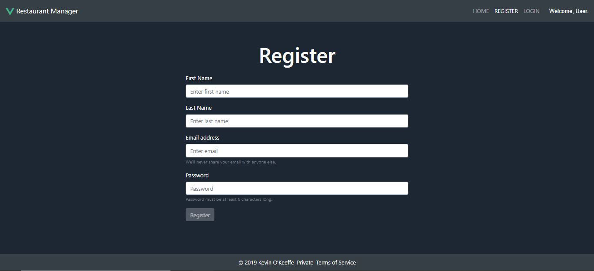
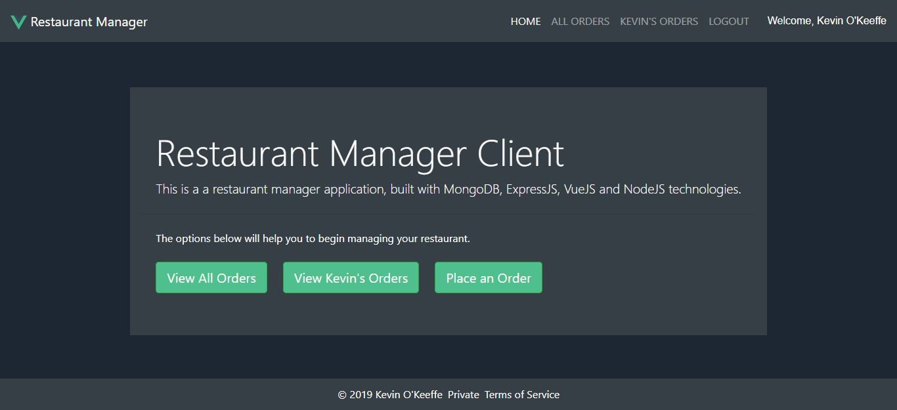
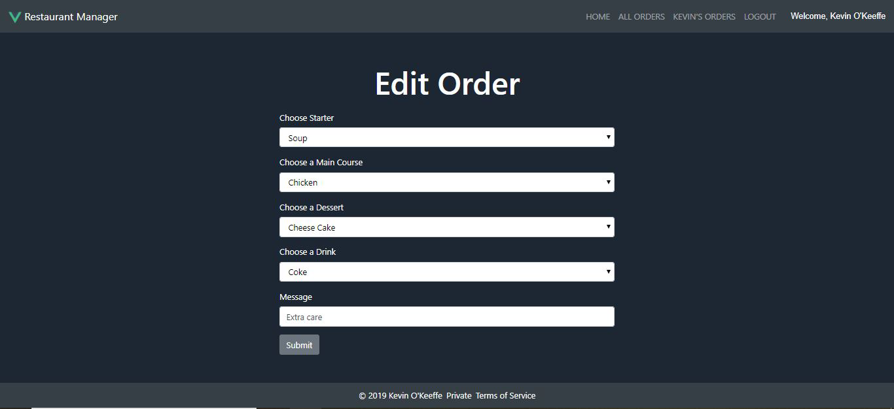

# Assignment 2 - Web App Development 2.

Name: Kevin O'Keeffe

The purpose of this project is to create a restaurant manager full stack web application using the MEVN (MongoDB, Express, Vue.js and Node.js) framework. 

[Demo Link](https://youtu.be/vLMOONja7YM)

### System features include:
- Token user authentication and validation.
- An auto logout feature when the user is idle for over 5 minutes.
- An auto logout when the page is closed.
- Fully CRUD.
- A specific user order list.
- User name displayed when logged in.
- Full cypress testing.
- CI-CD

## Client UI.

This is the default home page. Your options are to register or login. There is a short description of what the web app is about.

---

This is the Rregister page. Where a user can sign up.

---

This is the login page where the user can login with valid credentials.

---

This is the home page the user is presented with when the user is logged in.

---

This is the all orders page where all the orders from all useres on the database are shown.

---

This is the page where all the orders for the specif user logged in are shown.

---

This page lets the user add an order to the database.

---

This page lets the user edit the selected order on the database.

---

## E2E/Cypress testing.

- Tests execution is being recorded and uploaded to cypress.io.
- Authentication tests, including route guard.
- Selector not covered in class: 'clear()',cy.wait().

## Web API CI.

GitLab Page URL of the coverage report for the Web API tests.

https://kevnok.gitlab.io/restaurant-manager-4.0/coverage/lcov-report/

## GitLab CI.

- Deployment of client app to firebase hosting and deployment to surge.
- Uploading video results of Cypress test execution to a cypress.io dashboard.
- Using Cypress Docker image that comes with necessary dependencies to run cypress test in a CI environment.

Staging Client: [Restaurant Manager Staging Site](http://cool-shake.surge.sh/).

Staging API: [Restaurant Manager API](https://dashboard.heroku.com/apps/restaurant-manager-staging-app).

Production Client: [Restaurant Manager Prod Site](https://restaurantmanagerclient.web.app/).

Production API: [Restaurant Manager API](https://dashboard.heroku.com/apps/restaurant-manager-prod-app).

Client Gitlab Repo: [Restaurant Manager Client](https://gitlab.com/kevnok/restaurant-manager-client-side).

API Gitlab Repo: [Restaurant Manager API](https://gitlab.com/kevnok/restaurant-manager-4.0).

Cypress Dashboard URL: [Cyrpess Recordings](https://dashboard.cypress.io/projects/apx4gn/runs).

